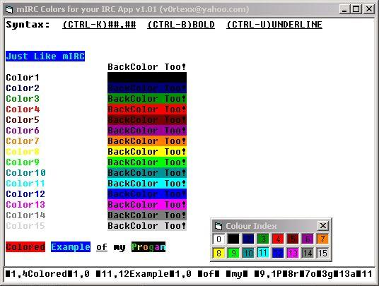



## mIRC Colors \(inc Backcolors\) v1\.1

### Description

Add mIRC Forecolors and *Backcolors* to your IRC App. This simply shows you how to set foreground colors and background colors (highlight) in a richtextbox just like mIRC does. I've been searching for something like this for a while, couldn't find it; so decided to write my own. This code is fully commented so you get to see how I did all this. I realize that this may have bugs in it. If so, could you please comment. This is my first submission so be easy on me folks :)

New in version 1.1

- Various bug fixes from 1.0.

- A simple to understand tutorial on RTF Formatting and how I used it in my program.

Vote if you like it. Thanks
 
### More Info
 

             |
---                |---
**Submitted On**   |2005-08-23 07:22:46
**By**             |[Garett Hudson](https://github.com/Planet-Source-Code/PSCIndex/blob/master/ByAuthor/garett-hudson.md)
**Level**          |Intermediate
**User Rating**    |3.7 (11 globes from 3 users)
**Compatibility**  |VB 5\.0, VB 6\.0
**Category**       |[Internet/ HTML](https://github.com/Planet-Source-Code/PSCIndex/blob/master/ByCategory/internet-html__1-34.md)
**World**          |[Visual Basic](https://github.com/Planet-Source-Code/PSCIndex/blob/master/ByWorld/visual-basic.md)
**Archive File**   |[mIRC\_Color1926678232005\.zip](https://github.com/Planet-Source-Code/garett-hudson-mirc-colors-inc-backcolors-v1-1__1-62283/archive/master.zip)

